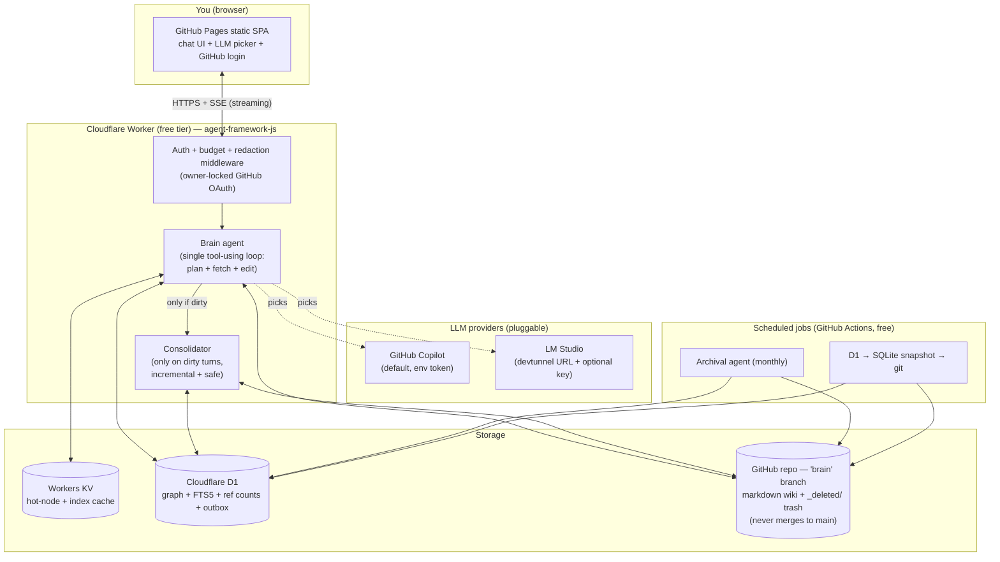
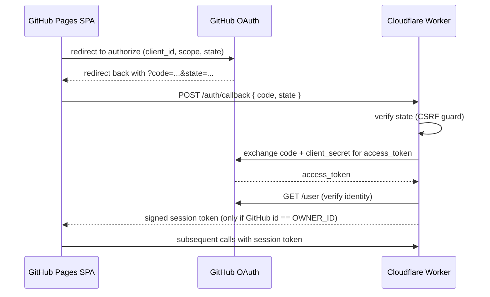
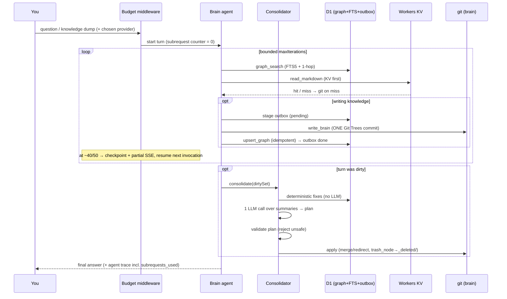

# Second Brain — Architecture

A personal, single-user "second brain": an LLM-maintained knowledge base (a *wiki*) that you
talk to through a chat interface. You ask questions or dump knowledge; a team of agents plans,
retrieves, writes, and continuously optimizes the wiki on your behalf.

It is inspired by Andrej Karpathy's idea of an LLM-maintained personal wiki — knowledge stored as
plain markdown that a model reads, writes, and keeps tidy — extended here with an explicit
**knowledge graph**, **continuous consolidation**, and **archival** so the brain stays efficient as
it grows.

> **Hard constraint: free for life, only for me.** Every component runs on a perpetual free tier,
> and the system is locked to a single owner identity.

---

## 1. Design constraints & principles

| Constraint | Consequence |
| --- | --- |
| **Free forever** | GitHub Pages (frontend) + Cloudflare Workers Free (backend) + Cloudflare D1 Free (graph) + GitHub repo (markdown). No paid tiers, ever. |
| **Single user (me)** | Auth locks the backend to one GitHub identity. No multi-tenant concerns. |
| **No backend filesystem** | Cloudflare Workers have no persistent disk; all state lives in D1 + the git repo, reached over HTTPS. |
| **Worker resource caps** | Free tier: **10 ms CPU/request**, **50 subrequests/request**, **6 simultaneous outgoing connections**, **128 MB memory**, **100k requests/day**, **5 Cron Triggers/account**. LLM/API calls are subrequests — the budget is the real design limit, enforced by middleware (see §9). |
| **Don't break GitHub Pages** | The wiki data lives on a dedicated branch that **never merges to `main`**. |
| **Disaster recovery** | If the Cloudflare account is ever lost, a periodic SQLite snapshot of D1 is committed to git so the brain can be rebuilt. D1 is also fully rebuildable from markdown frontmatter. |

**Principles**

1. **Markdown is the source of truth.** The graph (D1) is a fast, rebuildable *index* over markdown.
   If D1 is lost, it can be regenerated from the markdown frontmatter.
2. **One reasoning loop per turn.** A single tool-using *brain agent* handles planning, retrieval,
   and editing; a separate consolidator runs only when the turn changed something. This keeps the
   per-turn subrequest count roughly linear instead of multiplying nested agent loops.
3. **Consolidation is incremental and safe.** It runs only on the *touched subgraph*, does the cheap
   deterministic fixes with no LLM, and never hard-deletes — removed content moves to a `_deleted/`
   trash folder (excluded from the index) so nothing is ever truly lost.
4. **Consistency via outbox, not transactions.** D1 and git can't share a transaction, so writes go
   through an outbox + idempotent upserts that any later turn can reconcile.
5. **Least privilege & no secret leakage.** Credentials come from `getCredential` callbacks, are
   never logged or persisted (redaction middleware), and the backend is owner-locked.

---

## 2. High-level topology



---

## 3. Frontend (GitHub Pages, static)

A static single-page app (no server code), served free from GitHub Pages.

- **Chat interface** — message history, streaming responses (SSE), per-turn agent trace (which
  agent did what), and markdown rendering of brain content.
- **LLM picker** — choose the provider/model per session:
  - **GitHub Copilot** (default) — the backend already holds the token; the UI just selects a model.
  - **LM Studio** — the user supplies a **devtunnel URL** and an **optional key**; the backend uses
    these to reach the local LM Studio OpenAI-compatible endpoint.
- **GitHub login** — OAuth redirect flow (see §6). The client never holds the OAuth client secret;
  it receives a short session token from the Worker after login.
- **Talks only to the Worker** over HTTPS; CORS is restricted to the Pages origin.

> The frontend holds **no** persistent secrets. The LM Studio key, if provided, is sent per request
> over TLS and never persisted server-side.

---

## 4. Backend (Cloudflare Worker, free tier)

A single Worker built on `agent-framework-js`, exposing a small HTTP API (chat turn, auth callback,
health). It orchestrates the agents and mediates all access to storage and LLM providers.

### 4.1 LLM providers

| Provider | How it's wired | Notes |
| --- | --- | --- |
| **GitHub Copilot** (default) | `createCopilotProvider({ getCredential: () => env.COPILOT_TOKEN })` | Runs server-side (Workers are edge runtime → no browser CORS guard). Token is a **static env var**, refreshed manually (see §6.3). |
| **LM Studio** | `createOpenAICompatibleProvider({ baseUrl: <devtunnel>, getCredential: () => key })` | `baseUrl` and optional key come from the request. OpenAI-compatible, single-model. |

### 4.2 Agents

The design uses **one tool-using "brain" agent** plus a separate **consolidator** (run only when the
turn changed something), plus a monthly **archival** job that runs out-of-band. Collapsing the former
orchestrator/fetch/edit trio into a single reasoning loop is the biggest subrequest saver: nested
agents-as-tools multiply LLM calls (`orchestrator_iters × (fetch_iters + edit_iters)`), which alone
can exceed the 50-subrequest cap. "Fetch vs edit" is no longer a routing decision — it's just which
tools the brain agent calls.

| Agent | Role | Tools it can call |
| --- | --- | --- |
| **Brain agent** (single loop) | Plans how to answer / apply knowledge, retrieves grounded context, and writes/updates the wiki — all in one bounded `maxIterations` loop. Produces the final answer. | `graph_search`, `read_markdown`, `write_brain` (batched), `upsert_graph`, `bump_access`. |
| **Consolidator** (only on dirty turns) | Runs **only if the turn wrote something**, and only over the *touched subgraph* (`dirtySet` + 1-hop neighbors). Does cheap deterministic fixes with **no LLM** (dangling-edge repair, frontmatter normalization, exact-duplicate detection by content hash). Uses **one** LLM call — over node *summaries*, not bodies — to propose semantic merges, emitted as a **structured plan** that a deterministic validator checks before applying. | `consolidate` (dry-run → validate → apply), graph + markdown tools, `trash_node`. |
| **Archival agent** (monthly, out-of-band) | In **GitHub Actions**, scans for low-`ref_count` / stale `last_accessed` nodes, moves their markdown to `archive/`, flags `archived = 1`, prunes dead edges, runs reconcile, and writes the D1 snapshot. | Full graph + git access. |

**Consolidator safety guarantees** (so it never destroys knowledge):

- **Dry-run → validate → apply.** The LLM only emits a plan (`merge(a,b)`, `link(a,b)`, `trash(c)`);
  a deterministic validator rejects unsafe ops — no `trash` if `ref_count > 0` or inbound edges
  exist; no `merge` unless one side is a strict/near subset; merges are **union-then-redirect**
  (append unique content, repoint edges, leave a tombstone redirect so wiki links never 404).
- **No hard delete.** "Removed" content is **moved to a `_deleted/` trash folder** on the `brain`
  branch and its node is dropped from D1 + FTS — so it no longer pollutes search/context, but is
  fully recoverable from git. (No soft-delete flag, because a soft-deleted row would still surface in
  searched context.)
- **Idempotent.** Merges key on `(survivor_id, content_hash)`; re-running the same plan is a no-op,
  so a crash mid-consolidation is safe to retry. Large/risky bidirectional merges are **deferred to
  the monthly Actions job** instead of auto-applied.

### 4.3 Tools & contracts (the agent↔storage boundary)

Implemented as `agent-framework-js` local function tools with JSON-Schema validation. Search returns
**summaries only** (forcing a deliberate second read); writes are **always batched into one commit**;
graph ops are **idempotent**.

| Tool | Input | Output |
| --- | --- | --- |
| `graph_search` | `{ query, k=5, types?[], hops=1 }` | `[{ id, type, title, summary, md_path, score, neighbors:[{id,type,edge}] }]` — summaries only, no bodies (D1 FTS5 + 1-hop expansion). |
| `read_markdown` | `{ ids[] }` (KV-cached) | `[{ id, md_path, body, frontmatter }]`. |
| `write_brain` | `{ writes:[{ id?, type, title, summary, body, edges:[{to,type}] }] }` | `{ commit_sha, results:[{ id, path, action: created\|updated }] }` — **one Git Trees commit for all**. |
| `upsert_graph` | `{ nodes:[…], edges:[…] }` | `{ upserted, noop }` — idempotent on `(id, content_hash)`. |
| `consolidate` | `{ dirtySet:[id] }` | `{ plan:[{op,…}], applied:[…], deferred:[…] }` — dry-run → validate → apply. |
| `trash_node` | `{ id }` | `{ moved_to: "_deleted/…", ok }` — moves md to trash, drops node from D1/FTS. |
| `bump_access` | `{ ids[], kind }` | `{ ok }` — fire-and-forget; never blocks the answer. |

- GitHub writes use the **Git Trees + Commits API** so every turn is exactly **one commit** (not one
  commit per file), keeping git subrequests at ~2/turn and history growth bounded.

---

## 5. Storage model

### 5.1 Markdown wiki (GitHub repo, `brain` branch)

- Lives on a dedicated branch (e.g. `brain`) that **never merges to `main`** — it evolves forever
  and cannot disturb GitHub Pages or `main`.
- Folder structure is organized by entity/domain (decided by the agents as the brain grows), e.g.:

  ```text
  brain/
    people/        # one file per person
    projects/      # one file per project
    concepts/      # ideas, notes, definitions
    journal/       # dated entries
    archive/       # archived (rarely used) content, still indexed-on-demand
    _deleted/      # trash: removed content, NOT in D1/FTS, recoverable from git
    _backup/       # monthly D1 snapshot (disaster recovery only)
  ```

- Each file carries **YAML frontmatter** that mirrors its graph node, so the graph can always be
  rebuilt from markdown alone:

  ```markdown
  ---
  id: node_01H...
  type: concept
  title: Vector databases
  summary: Short one-line description shown in the graph index.
  created_at: 2026-06-18T10:00:00Z
  updated_at: 2026-06-18T10:00:00Z
  edges:
    - { to: node_01H..., type: relates_to }
  ---

  # Vector databases

  ...full detail lives here in markdown...
  ```

### 5.2 Knowledge graph (Cloudflare D1)

D1 is a **fast, rebuildable index** over the markdown. It stores nodes, typed edges, and reference
counts — each node points at a markdown file path plus a short description; the *detail* stays in
the markdown.

```sql
-- Nodes: one row per markdown file
CREATE TABLE nodes (
  id            TEXT PRIMARY KEY,      -- stable id (also in md frontmatter)
  type          TEXT NOT NULL,         -- person | project | concept | journal | ...
  title         TEXT NOT NULL,
  md_path       TEXT NOT NULL,         -- path on the 'brain' branch
  summary       TEXT NOT NULL,         -- short description; detail is in the md file
  ref_count     INTEGER NOT NULL DEFAULT 0,
  created_at    TEXT NOT NULL,
  updated_at    TEXT NOT NULL,
  last_accessed TEXT,                  -- drives archival
  archived      INTEGER NOT NULL DEFAULT 0
);

-- Typed, directed edges between nodes
CREATE TABLE edges (
  id     TEXT PRIMARY KEY,
  src    TEXT NOT NULL REFERENCES nodes(id),
  dst    TEXT NOT NULL REFERENCES nodes(id),
  type   TEXT NOT NULL,                -- relates_to | part_of | mentions | ...
  weight REAL NOT NULL DEFAULT 1.0
);

-- Optional access log feeding ref_count / archival decisions
CREATE TABLE access_log (
  node_id  TEXT NOT NULL REFERENCES nodes(id),
  ts       TEXT NOT NULL,
  kind     TEXT NOT NULL               -- read | write | edge_traverse
);

CREATE INDEX idx_nodes_type ON nodes(type);
CREATE INDEX idx_edges_src  ON edges(src);
CREATE INDEX idx_edges_dst  ON edges(dst);
```

- **Reference counting** lives in the same store (`nodes.ref_count`, with optional `access_log`).
  The fetching agent bumps it on each retrieval; archival uses it.

#### Full-text retrieval (FTS5) — no embeddings needed

Retrieval ranks candidates **inside D1** using an FTS5 virtual table (BM25), costing **zero Worker
CPU and zero extra subrequests** beyond the one D1 query. `graph_search` = FTS5 match → top-k node
ids → 1-hop graph expansion → return summaries; the agent then reads only the few bodies it needs.

```sql
CREATE VIRTUAL TABLE nodes_fts USING fts5(
  title, summary, tags, content='nodes', content_rowid='rowid'
);
```

> A free vector path (Cloudflare **Workers AI** `bge-small-en` + **Vectorize**, both free-tier)
> exists as a future fallback, but FTS5 is the default — simpler, free, no per-query embedding cost.

#### Write consistency (outbox)

Because D1 and git can't share a transaction, graph mutations go through an outbox so a crash between
"markdown committed" and "D1 updated" is always recoverable:

```sql
CREATE TABLE outbox (
  id          TEXT PRIMARY KEY,
  payload     TEXT NOT NULL,        -- staged node/edge mutations (JSON)
  commit_sha  TEXT,                 -- set after the git commit succeeds
  status      TEXT NOT NULL,        -- pending | done
  created_at  TEXT NOT NULL
);
```

Flow per write turn: stage mutation (`pending`) → one Git Trees commit → record `commit_sha` → apply
idempotent D1 upserts → mark `done`. Any later turn (and the monthly job) **reconciles** lingering
`pending` rows from their `commit_sha`. If D1 is ever lost entirely, it is rebuilt from markdown
frontmatter.

#### Hot cache (Workers KV)

The graph index (`id → {title, summary, md_path, type}`) and frequently read node bodies are cached
in **Workers KV** (free). `graph_search`/`read_markdown` consult KV first and only hit git on a miss;
KV keys are invalidated on write. This cuts the largest remaining subrequest source (git reads).

### 5.3 Disaster-recovery snapshot (D1 → git, monthly)

D1 is not stored in git at runtime (writing a blob per change is slow and race-prone). Instead, the
**monthly archival job also dumps D1 to a single SQLite/SQL file and overwrites it onto the `brain`
branch**. This blob is *never read at runtime* — it exists purely so that if the Cloudflare account
is deleted, you can spin up a fresh D1 from the snapshot (and/or rebuild it from markdown).

```text
brain/
  _backup/
    graph.sqlite      # or graph.sql dump — overwritten monthly
    graph.meta.json   # snapshot timestamp, row counts, schema version
```

---

## 6. Authentication & security (single owner)

### 6.1 GitHub OAuth from a static frontend (Worker-mediated)

GitHub OAuth **is** possible from a GitHub Pages static site because the **Worker** holds the
client secret:



- The **client secret never leaves the Worker** (`env.GH_CLIENT_SECRET`).
- A random **`state` parameter** is generated per login and validated on callback to prevent CSRF.
- The Worker **only issues a session** if the authenticated GitHub user id equals `env.OWNER_GH_ID`
  — this is what makes it "only for me."
- Fallback if OAuth setup is undesirable: **Cloudflare Access** (free, zero-trust gate with GitHub
  login) in front of the Worker.

### 6.2 Request-level protection

- CORS locked to the GitHub Pages origin.
- Every API call requires the signed session token; reject otherwise.
- The same GitHub token is reused as the credential for the GitHub API tools (read/write `brain`
  branch), scoped to the minimum repo permission.

### 6.3 Secrets & token handling

| Secret | Storage | Notes |
| --- | --- | --- |
| `COPILOT_TOKEN` | Worker env var | Short-lived in practice → **manual refresh** when it expires. The provider's `getCredential` wrapper detects 401/expired responses and surfaces a **loud, explicit error to the UI** ("Copilot token expired — refresh `COPILOT_TOKEN`") rather than failing silently. (Future option: derive it from a long-lived GitHub OAuth token on demand.) |
| `GH_CLIENT_SECRET` | Worker env var | OAuth code exchange only. |
| `OWNER_GH_ID` | Worker env var | The single allowed identity. |
| LM Studio key | Per-request, TLS only | Never logged or persisted. |

- Provider credentials are always supplied via `getCredential` callbacks and are **never** logged,
  bundled, or persisted (framework guarantee + observability secret redaction).

---

## 7. Turn lifecycle (end to end)

A single brain-agent loop does the work; the consolidator runs **only if the turn wrote something**.
Budget middleware counts every LLM/git/D1 subrequest and checkpoints near the cap so a long turn
resumes in the next Worker invocation instead of failing.



---

## 8. Scheduled jobs (GitHub Actions, free)

Heavy / periodic work runs in **GitHub Actions** (free for this use), not in the Worker:

1. **Archival (monthly):** scan the graph for low-`ref_count` / stale `last_accessed` nodes, move
   their markdown into `archive/`, flag `archived = 1` in D1, and prune dead edges.
2. **Reconcile (monthly):** re-derive any `pending` outbox rows from their `commit_sha`, and verify
   D1 matches markdown frontmatter — healing any split-brain left by an interrupted turn.
3. **D1 snapshot (monthly):** dump D1 to `brain/_backup/graph.sqlite` (+ meta) and commit to the
   `brain` branch for disaster recovery (§5.3).

GitHub Actions reaches D1 via the Cloudflare API (or a protected Worker admin endpoint) and reaches
markdown via normal git operations on the `brain` branch.

> Cloudflare Cron Triggers (5 free/account) are an alternative trigger, but GitHub Actions is chosen
> because the archival + snapshot work naturally produces git commits and isn't bound by the Worker
> 10 ms CPU / 50-subrequest caps.

---

## 9. Free-tier budget & limits (the real engineering risk)

The Cloudflare Worker Free tier is the tightest box. The numbers that matter per chat turn:

| Limit (Free) | Value | Implication for a turn |
| --- | --- | --- |
| **Subrequests / request** | **50** | Every LLM call **and** every GitHub API call is one subrequest. A multi-agent turn (orchestrator + fetch + edit + consolidator, each making several LLM + git calls) can approach this. **Budget must be tracked and capped.** |
| **CPU time / request** | **10 ms** | Pure compute only; time spent awaiting LLM/git I/O does **not** count. JSON parsing, graph assembly, and markdown diffing must stay cheap. |
| **Simultaneous outgoing connections** | **6** | Limits parallel LLM/git fan-out; `maxConcurrency` in workflows should respect this. |
| **Requests / day** | 100k | Far above single-user need. |
| **Memory** | 128 MB | Don't load the whole wiki into memory; page via graph queries. |

**Mitigations**

- **Budget middleware enforces the cap.** Every provider/git/D1 call is wrapped by middleware that
  increments a per-turn subrequest counter; at a soft cap (~40/50) it **checkpoints state to D1/KV,
  returns a partial SSE result, and resumes in the next Worker invocation** — turning a hard failure
  into graceful continuation. Idempotent upserts (§5.2) make resume/retry safe.
- **One reasoning loop, not nested agents** (§4.2) keeps LLM subrequests roughly linear.
- **Consolidator only on dirty turns, incremental, deterministic-first** (§4.2) — most read turns
  spend zero consolidation subrequests.
- **One Git Trees commit per turn** instead of one commit per file (~2 git subrequests/turn).
- **Workers KV cache** for hot nodes + the graph index cuts git round-trips; **D1 FTS5** ranks in
  the DB so retrieval costs one query, not many markdown reads.
- Respect the 6-connection cap with workflow `maxConcurrency ≤ 4` on any parallel reads.

---

## 10. Observability & failure handling

- **OpenTelemetry spans per turn** emit `subrequests_used`, `cpu_ms`, `git_calls`, `llm_calls`, and
  `dirtySet_size` — the early-warning signals for the caps. `subrequests_used` is also surfaced in
  the frontend agent-trace. Redaction middleware guarantees spans never carry secrets.
- **Loud failures, not silent ones.** Copilot token expiry (§6.3), D1/git outages, and budget
  overflow all produce explicit UI errors or partial-with-flag results — never a silently truncated
  answer.
- **Graceful degradation.** Per-tool `toolTimeout` + one jittered retry on git/D1; on repeated
  failure the agent answers from KV cache and flags "graph may be stale" instead of failing the turn.
- **Writes survive consolidation failure.** Because the markdown commit happens *before* the D1
  apply (outbox, §5.2), a consolidator crash at worst leaves a stale index that reconcile (§8) fixes
  — the user's knowledge is never lost.

---

## 11. Open questions / deferred

- **Offsite backup of markdown + rebuild runbook.** Today the only backup is the in-repo monthly D1
  snapshot; markdown itself has no separate offsite copy, and the D1-rebuild-from-frontmatter process
  isn't yet specified as a runbook (where it runs, its cost). *Deferred.*
- **LM Studio resilience.** No SLA on devtunnel, no URL validation (data-exfil risk), no automatic
  fallback to Copilot if the tunnel is down. *Deferred.*
- **Copilot token automation.** Move from static env var to on-demand OAuth exchange for hands-free
  refresh. *Deferred.*
- **Semantic search.** FTS5 is the default; Workers AI + Vectorize embeddings remain a future option
  if keyword + graph recall proves insufficient at scale.
- **GitHub API specifics & history bloat** over years of one-commit-per-turn (cleanup strategy).
- **Testing strategy** (D1↔git consistency integration tests; subrequest-budget load tests).

---

*This document is the planning baseline. Load-bearing decisions are settled: storage = Cloudflare D1
(graph + FTS5 + outbox) + git `brain` branch (markdown, `_deleted/` trash, `_backup/` snapshot);
auth = owner-locked GitHub OAuth with CSRF `state`; orchestration = a single tool-using brain agent +
conditional/incremental/safe consolidator; retrieval = D1 FTS5 + 1-hop graph + KV cache; budget =
enforced by middleware with checkpoint-resume; archival + reconcile + snapshot = monthly GitHub
Actions; Copilot token = static env var with loud-expiry handling. §11 lists what's still deferred.*
